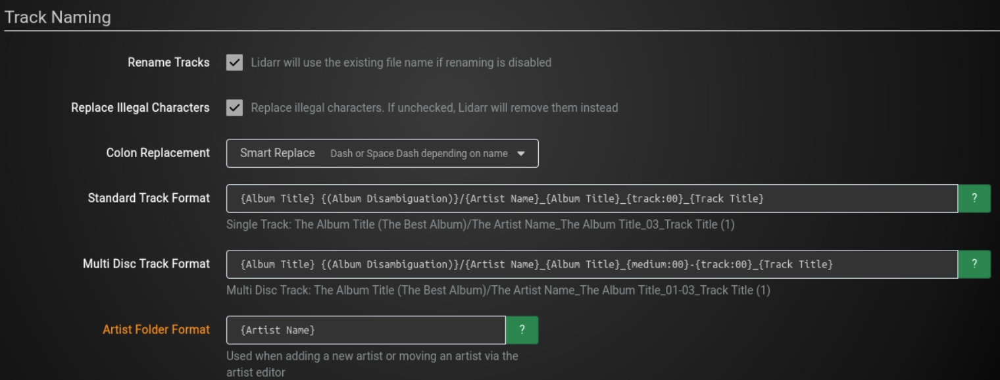
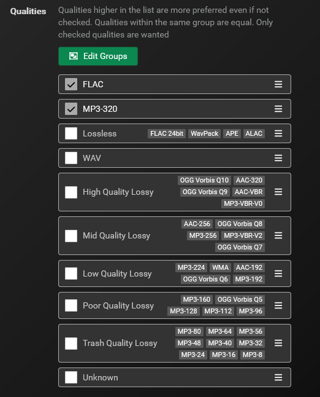
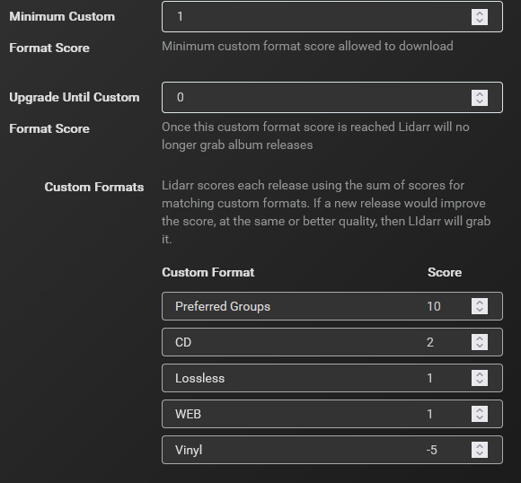
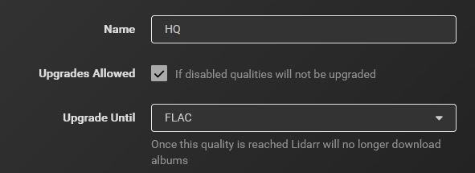
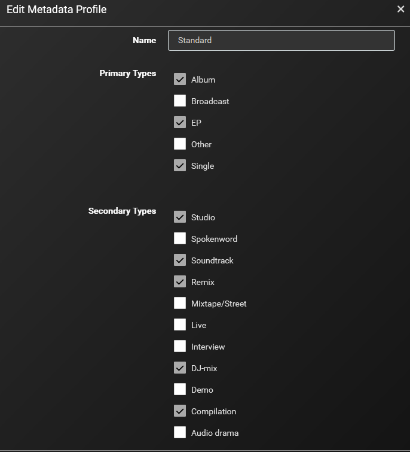
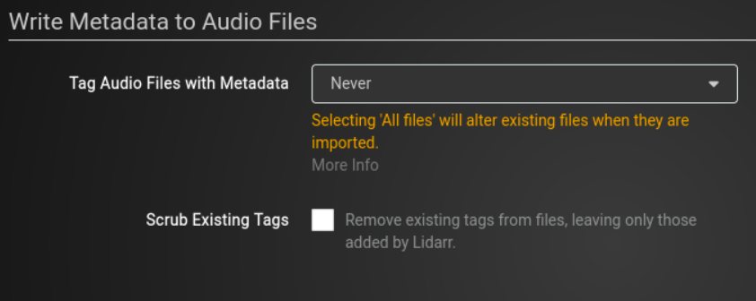

This guide is primarily focused on FLAC quality with MP3-320 as a fallback. Since music files are much smaller than other media I prefer to grab FLAC quality (not 24-bit lossless). Lidarr is designed to follow artists and albums, not singles. If you prefer singles then Spotify or Apple Music is a better fit for you.

This guide assumes familiarity with ARR apps and omits details covered in other guides, such as adding indexers or download clients.

## Quality settings

### FLAC

- Min - 0 bit/s
- Max - 1400 bit/s

### FLAC 24bit

- Min - 0 bit/s
- Max - 1495 bit/s

Minimizes results that are single track releases for an entire album, such as FLAC/CUE files.

## Recommended Naming Scheme

Ensure Advanced Settings are enabled and Rename Tracks & Replace Illegal Characters options are checked.

### Standard Track Format

```jinja
{Album Title} {(Album Disambiguation)}/{Artist Name}\_{Album Title}\_{track:00}\_{Track Title}
```

- Result: `Venus Hum/Big Beautiful Sky/Venus Hum_Big Beautiful Sky_01_Hummingbirds.flac`

### Multi Disc Track Format

```jinja
{Album Title} {(Album Disambiguation)}/{Artist Name}\_{Album Title}\_{medium:00}-{track:00}\_{Track Title}
```

- Result: `The Smashing Pumpkins/Mellon Collie and the Infinite Sadness/The Smashing Pumpkins_Mellon Collie and the Infinite Sadness_01-01_Mellon Collie and the Infinite Sadness.flac`

> Note: Without {(Album Disambiguation)} you run the risk of tracks for albums that have the same title (such as Weezer (Blue Album and Weezer (Red Album)) all being dumped into the same album folder (Weezer). If there is no disambiguation associated with an album then Lidarr will use the standard folder name.
{.is-info}

### Artist Folder Format

```jinja
{Artist Name}
```



> Unless your file system supports reflinks and/or you are not using Lidarr to write metadata info then you should not enable hardlinks. Changing the metadata for your media files will corrupt the original seeding files.
{.is-warning}

## Custom Formats

Below are some custom formats I have found to be helpful:

### Preferred groups

Release groups that are consistently high quality and are properly named/tagged

```json
{
  "name": "Preferred Groups",
  "includeCustomFormatWhenRenaming": false,
  "specifications": [
    {
      "name": "DeVOiD",
      "implementation": "ReleaseGroupSpecification",
      "negate": false,
      "required": false,
      "fields": {
        "value": "\\bDeVOiD\\b"
      }
    },
    {
      "name": "PERFECT",
      "implementation": "ReleaseGroupSpecification",
      "negate": false,
      "required": false,
      "fields": {
        "value": "\\bPERFECT\\b"
      }
    },
    {
      "name": "ENRiCH",
      "implementation": "ReleaseGroupSpecification",
      "negate": false,
      "required": false,
      "fields": {
        "value": "\\bENRiCH\\b"
      }
    }
  ]
}
```

### CD

Tag releases that are from CD source

```json
{
  "name": "CD",
  "includeCustomFormatWhenRenaming": false,
  "specifications": [
    {
      "name": "CD",
      "implementation": "ReleaseTitleSpecification",
      "negate": false,
      "required": false,
      "fields": {
        "value": "\\bCD\\b"
      }
    }
  ]
}
```

### WEB

Tag releases that are from WEB source

```json
{
  "name": "WEB",
  "includeCustomFormatWhenRenaming": false,
  "specifications": [
    {
      "name": "WEB",
      "implementation": "ReleaseTitleSpecification",
      "negate": false,
      "required": false,
      "fields": {
        "value": "\\bWEB\\b"
      }
    }
  ]
}
```

### Lossless

Tag releases that are lossless (flac/flac24), especially useful when using usenet to grab releases since file naming can be less than adequate

```json
{
  "name": "Lossless",
  "includeCustomFormatWhenRenaming": false,
  "specifications": [
    {
      "name": "Flac",
      "implementation": "ReleaseTitleSpecification",
      "negate": false,
      "required": false,
      "fields": {
        "value": "\\blossless\\b"
      }
    }
  ]
}
```

### Vinyl

Tag releases that are from Vinyl source

```json
{
  "name": "Vinyl",
  "includeCustomFormatWhenRenaming": false,
  "specifications": [
    {
      "name": "Vinyl",
      "implementation": "ReleaseTitleSpecification",
      "negate": false,
      "required": false,
      "fields": {
        "value": "\\bVinyl\\b"
      }
    }
  ]
}
```

## Profiles

Quality profiles - High Quality - check flac and mp3-320 and move them to the top



Upgrade until - set this to flac

Custom format scoring - This is very subjective. If you follow the table below it will require releases to include a minimum score of \`1\` in order to be grabbed, meaning it will need to meet at least one of the custom formats (except for vinyl) and will prefer CD source over WEB and will actively avoid vinyl releases.





### Metadata Profiles

This is another setting that is more personal preference. If you want to ensure you don’t miss any releases check all boxes and name the profile \`Any\`. My personal metadata profile is named \`Standard\` and I have the following options checked:





This minimizes the number of releases that are added for an artist but I can switch to the `Any` profile if needed to add specific releases that are not included in the above release types.

> Release types are determined by Musicbrainz so if you can’t find a specific release in Lidarr check the release type in Musicbrainz and ensure that release type is enabled in your metadata profile for that specific artist.
{.is-info}

> Nine times out of ten when a release can’t be found in Lidarr it’s because the release type is set to `unknown` in Musicbrainz. Lidarr cannot add releases that are listed as `unknown`
{.is-info}

### Metadata

As noted previously in the guide, if you are hardlinking music torrents then Tag Audio Files with Metadata needs to be set to Never and Scrub Existing Tags should be unchecked. If you are not hardlinking music torrents then this is personal preference.


