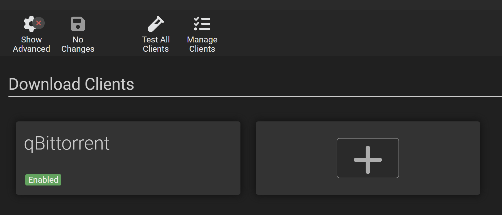

# Lidarr Quick Start

This guide walks you from a fresh Lidarr install to your first successful download in about fifteen minutes, using default settings everywhere. It assumes Lidarr is already installed — if it isn't, start with the [Installation](/lidarr/installation) page.

> Settings shown in `orange` in the Lidarr UI are advanced options. Click **Show Advanced** at the top of the relevant page to reveal them.
{.is-warning}

## Who this is for

This page is for users starting with an empty library who want to get to a first download quickly. The defaults used below are deliberately minimal and are safe to refine later.

If any of the following describes you, read the linked page instead — the quick path here will not work for your setup:

- You already have music files on disk and want Lidarr to manage them → [Importing an Existing Library](/lidarr/importing-existing-library).
- You want to understand *why* Lidarr behaves the way it does, or whether it fits your library at all → [Concepts](/lidarr/concepts).
- You need field-by-field detail on a setting → [Settings](/lidarr/settings).

## First start

After installation, open Lidarr in a browser at `http://<your-ip>:8686`.

Ignore the two options on the startup screen for now; you'll configure everything manually through Settings.

## Configure the essentials

Four settings areas need input before Lidarr can find and import music: Media Management, Profiles & Quality, Indexers, and Download Clients. Defaults are fine for everything except the items called out below.

### Media Management

Set a `Root Folder` — this is where imported music will live.

Click **Settings → Media Management**, then under **Root Folders** click **Add (+)**.

Fill in:

- **Name** — a friendly label.
- **Path** — the directory on disk where music files will be stored. The Lidarr user must have read and write access. **This must not be the same folder your download client writes to.**

Leave everything else at defaults.

> Do not put Lidarr's root folder on a cloud storage provider. Lidarr writes tags frequently, which will exhaust cloud-service API quotas and cause failures. Keep the library on local or network-attached storage.
{.is-warning}

> NFS mounts need `nolock`; SMB mounts need `nobrl`. Non-Windows only.
{.is-warning}

> The root folder must not overlap with your download client's output folder. Lidarr imports *from* downloads *to* the root folder — they need to be distinct locations on the same filesystem (for fast moves and hardlinks).
{.is-danger}

If you already have music files here, stop — see [Importing an Existing Library](/lidarr/importing-existing-library) before saving this root folder.

### Profiles & Quality

`Settings → Profiles` and `Settings → Quality` — leave both at defaults. They're good enough to get to a first download. You can refine them later; see [Settings → Profiles](/lidarr/settings#profiles) and [Settings → Quality](/lidarr/settings#quality).

### Indexers

`Settings → Indexers` — add at least one. Lidarr treats Usenet indexers and BitTorrent trackers both as `Indexers`.

Click **Add (+)** and pick one you have access to. Choosing and configuring an indexer is outside the scope of this page — see the [Supported Indexers](/lidarr/supported#indexers) list and [TRaSH's indexer guides](https://trash-guides.info/) for options and setup details.

### Download Clients

`Settings → Download Clients` — add at least one.

Lidarr sends downloads to your client with a label/category (e.g. `music`), watches the client's API for completion, then imports finished files into your root folder. The client and Lidarr must both be able to read the same filesystem path, and that path must be on the same mount as your root folder for hardlinks and atomic moves to work.

> Volume and path configuration is the single most common source of import failures, especially with Docker. If Lidarr and your download client run in separate containers, both must mount the same host path at the same container path. See [Installation → Docker](/lidarr/installation/docker#volumes-and-paths) and [TRaSH's hardlink guide](https://trash-guides.info/hardlinks/) before configuring.
{.is-info}

For field-level detail see [Settings → Download Clients](/lidarr/settings#download-clients) and the [Supported Download Clients](/lidarr/supported#download-clients) list.

## Add your first artist

With settings done, add an artist. `Library → Add New`.

Search for the artist you want — Lidarr looks them up in MusicBrainz. Select the result and the **Add new Artist** dialog opens.

Keep the defaults:

- **Root Folder** — the one you just created.
- **Monitor** — None (for now).
- **Quality Profile** — Any.
- **Tags** — empty.
- **Start search for missing albums** — unchecked.

Save. Lidarr fetches the artist's metadata from MusicBrainz; this takes a few seconds to a few minutes depending on the artist's catalog size.

Click the new artist when it appears.

> With the default `Metadata Profile`, only `Releases` of type **Studio Album** are shown. See [Concepts](/lidarr/concepts) for why the metadata profile matters.
{.is-info}

## Trigger your first download

On the artist page, pick a `Release` to download and click the **Manual Search** (human) icon next to it.

Lidarr queries your indexers and shows available results.

Each row shows:

1. **Title** — the release name as returned by the indexer.
2. **Quality** — Lidarr's parse of the title into a quality level.
3. **Warning indicators** — if a result fails a check (wrong album, wrong quality, etc.) the reason is shown here.
4. **Download icon** — click to send the release to your download client.

Pick a clean result and click the download icon. Lidarr hands the download off to your client, watches the queue, and imports the finished files into your root folder when the client reports completion.

Your imported files will be in the root folder, organized as `<Root Folder>/<Artist>/<Release>/<Track>`.

That's the full loop — settings, artist, release, download, import.

## What to read next

- [Concepts](/lidarr/concepts) — the `Release` and `Artist` model, and why Lidarr's behavior depends on MusicBrainz.
- [Importing an Existing Library](/lidarr/importing-existing-library) — migrating files you already have into Lidarr.
- [Settings](/lidarr/settings) — the detailed reference for every configuration option referenced on this page.
- [FAQ](/lidarr/faq) — common questions and troubleshooting.
